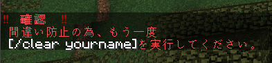

# ConfirmWhirlwind

特定のコマンド実行時にもう一度同じコマンドを打つことで確認を行うようにするSpigotプラグイン



## Config
確認を行うコマンドは`config.yml`の`commands-to-confirm`で指定できます。  
正規表現での指定が可能です。

例:
```
commands-to-confirm:
  - "summon creeper ~ ~ ~"
  - "clear \\w{1,16}"
```

## Build
プラグインのビルドには`shadowJar`タスクを実行してください。